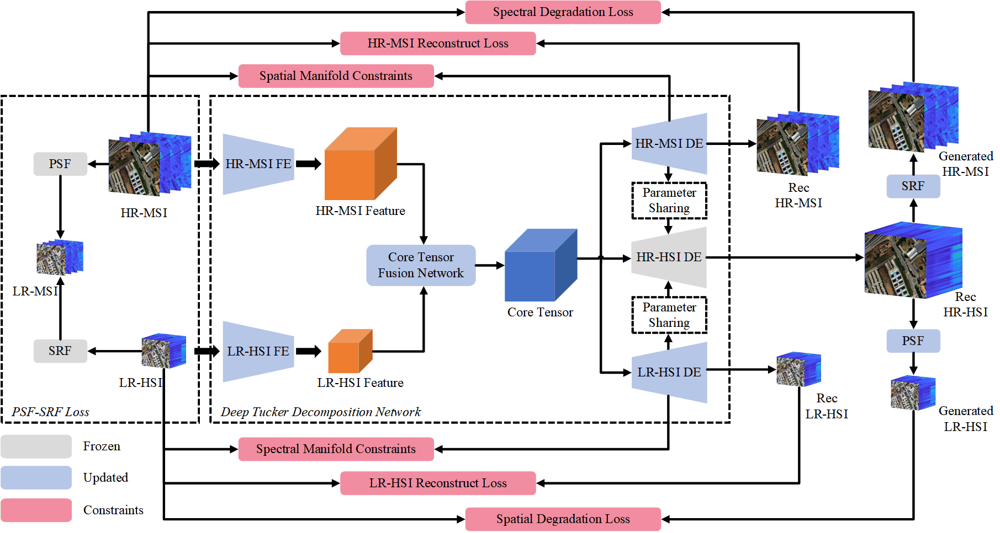

# Unsupervised Hyperspectral and Multispectral Image Blind Fusion Based on Deep Tucker Decomposition Network with Spatial-Spectral Manifold Learning

He Wang, Yang Xu\*, Zebin Wu, Zhihui Wei

Code for the paper: Unsupervised Hyperspectral and Multispectral Image Blind Fusion Based on Deep Tucker Decomposition Network with Spatial-Spectral Manifold Learning-*TNNLS* 2024

<div align="center">

</div>

## Code Running 
Simple run `./main.py` or `./bash.sh` demo to implement the fusion of low-resolution hyperspectral image (LR-HSI) and high-resolution multispectral image (HR-MSI) of Sandiego. (Using [PyTorch](https://pytorch.org/) with `Python 3.7` implemented on `Windows` OS or `Linux` OS)

- Before: For the required packages, please refer to detailed `.py` files.
- Parameters: The trade-off parameters as `train_opt.lambda_*` could be better tuned and the network hyperparameters are flexible.
- Results: Please see the five evaluation metrics (PSNR, SAM, ERGAS, SSIM, and UIQI) logged in `./checkpoints/*name*/precision.txt` and the output `.mat` files saved in `./Results/*name*/`.
- Runtime: ca. 30 mins per HSI using a single GTX3090.

:exclamation: You may need to manually simulate the two HSIs to your local in the folder under path `./main.py`. The simulation code implemented via MATLAB will be provided in this repository.

## References
If you find this code helpful, please kindly cite:

[1] Wang, He, et al. "Unsupervised Hyperspectral and Multispectral Image Blind Fusion Based on Deep Tucker Decomposition Network with Spatial-Spectral Manifold Learning." In *IEEE Transactions on Neural Network and Learning System* (2024), DOI:10.1109/TNNLS.2024.3457781.

## Citation Details

```
@article{DTDNML,
	title={Unsupervised Hyperspectral and Multispectral Image Blind Fusion Based on Deep Tucker Decomposition Network with Spatial-Spectral Manifold Learning},  
	author={Wang, He and Xu, Yang and Wu, Zebin and Wei, Zhihui},  
	journal={IEEE Transactions on Neural Networks and Learning Systems}, 
	volume={}, 
	pages={}, 
	year={2024}, 
	publisher={IEEE}, 
	note = {},
    doi={10.1109/TNNLS.2024.3457781}
}
```

## Licensing

Copyright (C) 2024 He Wang and Yang Xu

This program is free software: you can redistribute it and/or modify it under the terms of the GNU General Public License as published by the Free Software Foundation, version 3 of the License.

This program is distributed in the hope that it will be useful, but WITHOUT ANY WARRANTY; without even the implied warranty of MERCHANTABILITY or FITNESS FOR A PARTICULAR PURPOSE. See the GNU General Public License for more details.

You should have received a copy of the GNU General Public License along with this program.

## Contact

If you are interested in our work or encounter any bugs while using this code, please do not hesitate to contact us.

Sciencerely,

He Wang
<br>
School of Computer Science and Engineering
<br>
Nanjing University of Science and Technology
<br>
Email: he_wang@njust.edu.cn
<br>
WeChat: shawn_he_wang
